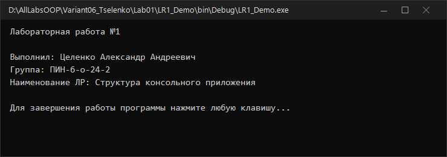
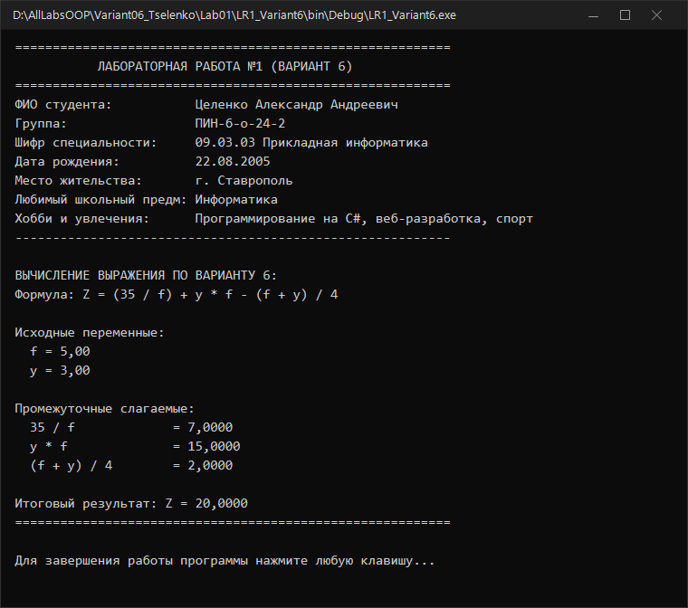

# Северо-Кавказский федеральный университет
**Институт цифрового развития**  
**Кафедра прикладной информатики**

---

### ОТЧЕТ
### по лабораторной работе №1
**по дисциплине: «Объектно-ориентированное программирование»**  
**Тема: «Разработка консольного приложения»**  
**Вариант №6**

**Выполнил:**  
студент группы ПИН-б-о-24-2  
Целенко А. А.  

Ставрополь, 2026 г.

---

## 1. Цель и задачи работы

**Цель работы:** Научиться работать с переменными и константами простых типов в C#.

**Задачи работы:**
1. Научиться объявлять переменные простых типов в языке C#.
2. Научиться объявлять константы простых типов в языке C#.
3. Научиться выполнять простейшие действия с переменными и константами.
4. Освоить вывод данных на консоль с использованием простого и форматного вывода.

---

## 2. Ход выполнения работы

### 2.1. Учебная задача (демонстрационный пример)
Было создано консольное приложение на языке C# (`.NET Framework 4.8`). В методе `Main()` реализован вывод персональных данных о лабораторной работе и удержание консольного окна с помощью `Console.ReadKey()`.

**Листинг программы (`LR1_Demo/Program.cs`):**
```csharp
using System;
using System.Collections.Generic;
using System.Linq;
using System.Text;

namespace LR_One
{
    class Program
    {
        static void Main(string[] args)
        {
            Console.OutputEncoding = Encoding.UTF8;
            Console.WriteLine("Лабораторная работа №1");
            Console.WriteLine("");
            Console.WriteLine("Выполнил: Целенко Александр Андреевич");
            Console.WriteLine("Группа: ПИН-б-о-24-2");
            Console.WriteLine("Наименование ЛР: Структура консольного приложения");
            Console.WriteLine("");
            Console.WriteLine("Для завершения работы программы нажмите любую клавишу...");

            if (!Console.IsInputRedirected)
            {
                Console.ReadKey();
            }
        }
    }
}
```

**Результат выполнения учебной задачи:**



---

### 2.2. Индивидуальное задание (Вариант 6)

#### Постановка задачи:
1. **Часть 1:** Изменить приложение таким образом, чтобы программа выводила на экран персональную информацию о студенте:
   - Номер и название лабораторной работы;
   - ФИО студента;
   - Группа и шифр специальности;
   - Дата рождения;
   - Населенный пункт постоянного места жительства;
   - Любимый предмет в школе;
   - Краткое описание увлечений и хобби.
2. **Часть 2:** Вычислить значение выражения по варианту 6 с использованием форматной строки:
   $$Z = \frac{35}{f} + y \cdot f - \frac{f + y}{4}$$
   Переменные: вещественные числа $f, y$.

#### Исходный код программы (`LR1_Variant6/Program.cs`):
```csharp
using System;
using System.Collections.Generic;
using System.Linq;
using System.Text;

namespace LR_One_Variant6
{
    class Program
    {
        static void Main(string[] args)
        {
            Console.OutputEncoding = Encoding.UTF8;

            // Часть 1. Вывод персональной информации о студенте
            Console.WriteLine("==========================================================");
            Console.WriteLine("           ЛАБОРАТОРНАЯ РАБОТА №1 (ВАРИАНТ 6)             ");
            Console.WriteLine("==========================================================");
            Console.WriteLine("ФИО студента:           Целенко Александр Андреевич");
            Console.WriteLine("Группа:                 ПИН-б-о-24-2");
            Console.WriteLine("Шифр специальности:     09.03.03 Прикладная информатика");
            Console.WriteLine("Дата рождения:          22.08.2005");
            Console.WriteLine("Место жительства:       г. Ставрополь");
            Console.WriteLine("Любимый школьный предм: Информатика");
            Console.WriteLine("Хобби и увлечения:      Программирование на C#, веб-разработка, спорт");
            Console.WriteLine("----------------------------------------------------------\n");

            // Часть 2. Вычисление выражения по варианту 6:
            // Z = (35 / f) + y * f - (f + y) / 4
            Console.WriteLine("ВЫЧИСЛЕНИЕ ВЫРАЖЕНИЯ ПО ВАРИАНТУ 6:");
            Console.WriteLine("Формула: Z = (35 / f) + y * f - (f + y) / 4\n");

            double f = 5.0;
            double y = 3.0;

            double term1 = 35.0 / f;
            double term2 = y * f;
            double term3 = (f + y) / 4.0;
            double Z = term1 + term2 - term3;

            Console.WriteLine("Исходные переменные:");
            Console.WriteLine("  f = {0:0.00}", f);
            Console.WriteLine("  y = {0:0.00}", y);
            Console.WriteLine();
            Console.WriteLine("Промежуточные слагаемые:");
            Console.WriteLine("  35 / f             = {0:0.0000}", term1);
            Console.WriteLine("  y * f              = {0:0.0000}", term2);
            Console.WriteLine("  (f + y) / 4        = {0:0.0000}", term3);
            Console.WriteLine();
            Console.WriteLine("Итоговый результат: Z = {0:0.0000}", Z);
            Console.WriteLine("==========================================================");
            Console.WriteLine("\nДля завершения работы программы нажмите любую клавишу...");

            if (!Console.IsInputRedirected)
            {
                Console.ReadKey();
            }
        }
    }
}
```

#### Результат выполнения индивидуального задания:



---

## 3. Ответы на контрольные вопросы

**1. Какая функция имеет особенное значение при выполнении программы на языках C, C++, C#?**  
Функция (метод) `Main()`. Она является точкой входа в приложение, с которой среда исполнения начинает выполнение программы.

**2. Что такое «точка входа» в программе?**  
Точка входа — это функция/метод, с выполнения которого начинается исполнение программы после загрузки сборки операционной системой и средой CLR в оперативную память.

**3. Как вы понимаете термины «пространства имен», «класс», «метод», «функция»? Напишите определение каждому термину.**  
- *Пространство имен (`namespace`)* — логический механизм группировки типов (классов, структур, интерфейсов) для организации структуры проекта и предотвращения конфликтов одинаковых имен.  
- *Класс (`class`)* — ссылочный тип данных, являющийся шаблоном (моделью) для создания объектов, описывающий структуру их данных (полей, свойств) и поведения (методов).  
- *Метод (`method`)* — именованный блок кода внутри класса или структуры, определяющий поведение объекта и манипулирующий его полями.  
- *Функция (`function`)* — подпрограмма, принимающая входные параметры и возвращающая результат. В C# все функции оформляются как методы классов.

**4. Что такое переменная? Как объявляется переменная?**  
Переменная — это именованная область оперативной памяти определенного типа, хранящая данные, которые могут изменяться во время работы программы.  
Синтаксис объявления: `ТипДанных ИмяПеременной;` или с инициализацией: `ТипДанных Имя = Значение;`.

**5. Как объявляется константа? Чем константа отличается от переменной?**  
Константа объявляется с ключевым словом `const`: `const double Pi = 3.14159;`. В отличие от переменной, константа должна быть проинициализирована при объявлении, а её значение вычисляется на этапе компиляции и не может быть изменено во время выполнения программы.

**6. Перечислите целочисленные типы C#.**  
- Со знаком: `sbyte` (8 бит), `short` (16 бит), `int` (32 бита), `long` (64 бита).  
- Без знака: `byte` (8 бит), `ushort` (16 бит), `uint` (32 бита), `ulong` (64 бита).

**7. Перечислите отличия типов char и string.**  
- `char` — значимый тип (`System.Char`), хранит ровно один 16-битный символ в кодировке Unicode, заключается в одинарные кавычки (`'A'`).  
- `string` — ссылочный тип (`System.String`), представляет собой неизменяемую последовательность символов Unicode произвольной длины, заключается в двойные кавычки (`"Text"`).

**8. Какие из перечисленных идентификаторов нельзя использовать в качестве имен пользовательских переменных?**  
*Перечень:* `_1_01, b100, int, double_1, _b200, MyVar, create-var, 4perem, _5elem, zo0, wodoo, UserCount, system_call, string, System.Double`.  
**Нельзя использовать:**
- `int` — зарезервированное ключевое слово языка C#;
- `string` — зарезервированное ключевое слово языка C#;
- `create-var` — содержит недопустимый символ дефиса (знак минус `-`);
- `4perem` — начинается с цифры (идентификаторы в C# не могут начинаться с цифры);
- `System.Double` — содержит точку (символ доступа к членам), является полным именем типа.

**9. Опишите назначение управляющих последовательностей: ‘\n’, ‘\t’, ‘\r’.**  
- `\n` — перевод строки (Line Feed);
- `\t` — горизонтальная табуляция (отступ в 4/8 позиций);
- `\r` — возврат каретки в начало текущей строки (Carriage Return).

**10. Имеется список типов: значимые типы, ссылки на функции, ссылочные типы, массивы, делегаты, корреляционные типы, типы по умолчанию. Какие из представленных типов отсутствуют в иерархии типов CTS?**  
В спецификации Common Type System (CTS) **отсутствуют**:
- Ссылки на функции (вместо них в .NET используются делегаты);
- Корреляционные типы;
- Типы по умолчанию.

**11. К какой ветке дерева типов принадлежат типы int, float, double?**  
Они принадлежат к ветке **встроенных типов по значению** (Built-in Value Types), наследуясь от `System.ValueType`.

**12. На какой тип отображается тип float в библиотеке .NET?**  
Тип `float` отображается на тип `System.Single`.

**13. Среди представленных типов укажите те, которые не предназначены для представления целых чисел:** `System.Single, System.Int32, System.Byte, System.Int64, System.Char, float, System.String`.  
Не предназначены для целых чисел: `System.Single`, `float` (числа с плавающей точкой) и `System.String` (текстовые строки).

**14. Выберите наиболее корректное определение для термина «компоновочный блок» (assembly):**  
Наиболее корректное определение: **«это файлы двоичного формата (*.exe или *.dll), содержащие IL-код, метаданные, манифест»**.

**15. Выпишите строки кода, в которых пользователь объявил переменную:**  
Из предложенного листинга:
1. `int a;`
2. `int b = 7;`
3. `string str = "Hello, World!!!";`
4. `int a = 150;`
5. `float z = 180;`
6. `string s = "Hi!";`
7. `System.Int32 ee = 1;`

---

## 4. Вывод
В ходе выполнения лабораторной работы были изучены структура консольного приложения на языке C# в среде Visual Studio, правила объявления и инициализации переменных базовых типов данных, работа со стандартным выводом в консоль и применение форматных строк. Были решены учебная задача и индивидуальное задание варианта №6.
