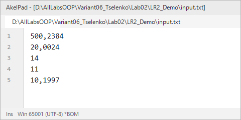
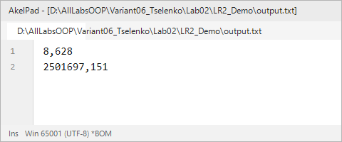
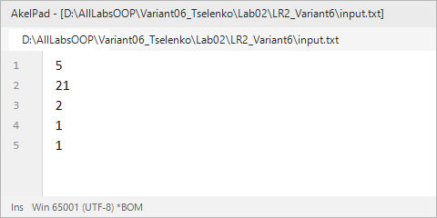
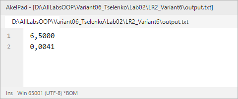
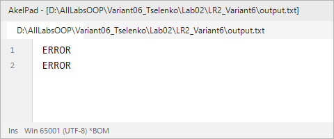

# Северо-Кавказский федеральный университет
**Институт цифрового развития**  
**Кафедра прикладной информатики**

---

### ОТЧЕТ
### по лабораторной работе №2
**по дисциплине: «Объектно-ориентированное программирование»**  
**Тема: «Перенаправление потоков ввода-вывода»**  
**Вариант №6**

**Выполнил:**  
студент группы ПИН-б-о-24-2  
Целенко А. А.  

Ставрополь, 2026 г.

---

## 1. Цель и задачи работы

**Цель работы:** Научиться перенаправлять стандартные потоки ввода-вывода.

**Задачи работы:**
1. Научиться сохранять состояние стандартных потоков ввода-вывода.
2. Научиться объявлять новые потоки, ассоциированные с файлами на диске.
3. Научиться решать вычислительные задачи с вводом-выводом данных через файлы.
4. Научиться корректно восстанавливать исходное состояние потоков и освобождать ресурсы.

---

## 2. Ход выполнения работы

### 2.1. Учебная задача (демонстрационный пример)
В учебной задаче рассматривается механизм перенаправления потоков ввода и вывода с помощью методов `Console.SetIn()` и `Console.SetOut()`. Программа считывает 5 вещественных чисел из файла `input.txt`, производит расчет выражений `my_tmp` и `geo` с проверкой условий области допустимых значений (ОДЗ) и записывает результаты в `output.txt`.

**Листинг программы (`LR2_Demo/Program.cs`):**
```csharp
using System;
using System.IO;

namespace LR_Two_Demo
{
    class Program
    {
        static void Main(string[] args)
        {
            TextWriter save_out = Console.Out;
            TextReader save_in = Console.In;

            var new_out = new StreamWriter(@"output.txt");
            var new_in = new StreamReader(@"input.txt");

            Console.SetOut(new_out);
            Console.SetIn(new_in);

            double a_71, _u2, test, zoo, x;
            double my_tmp, geo;

            a_71 = Convert.ToDouble(Console.ReadLine().Trim().Replace('.', ','));
            _u2 = Convert.ToDouble(Console.ReadLine().Trim().Replace('.', ','));
            test = Convert.ToDouble(Console.ReadLine().Trim().Replace('.', ','));
            zoo = Convert.ToDouble(Console.ReadLine().Trim().Replace('.', ','));
            x = Convert.ToDouble(Console.ReadLine().Trim().Replace('.', ','));

            if ((x == 0) || (a_71 - zoo == 0) || ((_u2 - test) / x < 0))
            {
                Console.WriteLine("ERROR");
            }
            else
            {
                my_tmp = a_71 * Math.Sqrt((_u2 - test) / x) * zoo / (a_71 - zoo);
                Console.WriteLine(string.Format("{0:0.000}", my_tmp));
            }

            if (_u2 == 0 || (x / _u2 < 0))
            {
                Console.WriteLine("ERROR");
            }
            else
            {
                geo = Math.Sqrt(x / _u2) * a_71 * a_71 * test;
                Console.WriteLine(string.Format("{0:0.000}", geo));
            }

            Console.SetOut(save_out);
            new_out.Close();
            Console.SetIn(save_in);
            new_in.Close();
        }
    }
}
```

**Входные и выходные файлы учебной задачи:**

| Входной файл `input.txt` | Выходной файл `output.txt` |
|---|---|
|  |  |

---

### 2.2. Индивидуальное задание (Вариант 6)

#### Постановка задачи:
Требуется вычислить значения двух выражений $s$ и $k$:
$$s = \frac{\sqrt{a2 - a1}}{a3 - a5} + \frac{a1}{a3}$$
$$k = \sqrt{\frac{a3 + a4}{3.14 - a3}} \times \frac{1}{(a2 - a5)^2}$$

- **Входные данные:** Вещественные числа $a1, a2, a3, a4, a5 \in [0, 10^5]$, записанные построчно в файле `input.txt`.
- **Выходные данные:** Вещественные числа $s$ и $k$, записанные построчно в файл `output.txt` с округлением до десятитысячных (`0.0000`). Если вычислить выражение невозможно из-за нарушения ОДЗ, программа выводит слово `ERROR`.

#### Анализ ОДЗ:
1. **Для выражения $s$:**
   - $a2 - a1 \ge 0$ (неотрицательность подкоренного выражения);
   - $a3 - a5 \ne 0$ (знаменатель первого слагаемого не равен нулю);
   - $a3 \ne 0$ (знаменатель второго слагаемого не равен нулю).
2. **Для выражения $k$:**
   - Так как по условию $a3 \ge 0$ и $a4 \ge 0$, то числитель $a3 + a4 \ge 0$. Для того чтобы подкоренное выражение было неотрицательным и знаменатель не равнялся нулю, необходимо, чтобы $3.14 - a3 > 0 \iff a3 < 3.14$.
   - $a2 - a5 \ne 0$ (знаменатель $(a2 - a5)^2$ не равен нулю).

#### Исходный код программы (`LR2_Variant6/Program.cs`):
```csharp
using System;
using System.IO;

namespace LR_Two_Variant6
{
    class Program
    {
        static void Main(string[] args)
        {
            // Сохраняем исходные потоки ввода-вывода
            TextWriter save_out = Console.Out;
            TextReader save_in = Console.In;

            // Связываем стандартные потоки с файлами
            var new_out = new StreamWriter(@"output.txt");
            var new_in = new StreamReader(@"input.txt");

            Console.SetOut(new_out);
            Console.SetIn(new_in);

            double a1, a2, a3, a4, a5;
            double s, k;

            // Считывание входных данных из файла input.txt
            a1 = Convert.ToDouble(Console.ReadLine().Trim().Replace('.', ','));
            a2 = Convert.ToDouble(Console.ReadLine().Trim().Replace('.', ','));
            a3 = Convert.ToDouble(Console.ReadLine().Trim().Replace('.', ','));
            a4 = Convert.ToDouble(Console.ReadLine().Trim().Replace('.', ','));
            a5 = Convert.ToDouble(Console.ReadLine().Trim().Replace('.', ','));

            // Вычисление выражения s:
            // s = sqrt(a2 - a1) / (a3 - a5) + a1 / a3
            // ОДЗ: a2 - a1 >= 0, a3 - a5 != 0, a3 != 0
            if ((a2 - a1 < 0) || (a3 - a5 == 0) || (a3 == 0))
            {
                Console.WriteLine("ERROR");
            }
            else
            {
                s = (Math.Sqrt(a2 - a1) / (a3 - a5)) + (a1 / a3);
                Console.WriteLine(string.Format("{0:0.0000}", s));
            }

            // Вычисление выражения k:
            // k = sqrt((a3 + a4) / (3.14 - a3)) * (1 / (a2 - a5)^2)
            // ОДЗ: 3.14 - a3 > 0, a2 - a5 != 0
            if ((3.14 - a3 <= 0) || ((a3 + a4) / (3.14 - a3) < 0) || (a2 - a5 == 0))
            {
                Console.WriteLine("ERROR");
            }
            else
            {
                k = Math.Sqrt((a3 + a4) / (3.14 - a3)) * (1.0 / Math.Pow(a2 - a5, 2));
                Console.WriteLine(string.Format("{0:0.0000}", k));
            }

            // Восстановление потоков и закрытие файлов
            Console.SetOut(save_out);
            new_out.Close();
            Console.SetIn(save_in);
            new_in.Close();
        }
    }
}
```

#### Результаты выполнения индивидуального задания:

**Тест 1. Корректные входные данные ($a1=5, a2=21, a3=2, a4=1, a5=1$):**
- Расчет $s$: $\frac{\sqrt{21 - 5}}{2 - 1} + \frac{5}{2} = \frac{4}{1} + 2.5 = 6{,}5000$.
- Расчет $k$: $\sqrt{\frac{2 + 1}{3.14 - 2}} \cdot \frac{1}{(21 - 1)^2} = \sqrt{\frac{3}{1.14}} \cdot \frac{1}{400} \approx \frac{1.6222}{400} \approx 0{,}0041$.

| Входной файл `input.txt` | Выходной файл `output.txt` |
|---|---|
|  |  |

**Тест 2. Недопустимые данные (нарушение ОДЗ, $a1=25, a2=10, a3=5, a4=1, a5=1$):**
- Так как $a2 - a1 = -15 < 0$ и $3.14 - a3 = -1.86 < 0$, оба выражения недопустимы. Программа выводит `ERROR`:



---

## 3. Ответы на контрольные вопросы

**1. Укажите различие между `Console.Write()` и `Console.WriteLine()`.**  
`Console.Write()` выводит текст в консоль без перехода на следующую строку (курсор остается сразу за выведенным текстом). `Console.WriteLine()` после вывода текста автоматически добавляет терминатор строки (`Environment.NewLine`), перемещая курсор на новую строку.

**2. Опишите метод `Console.ReadKey()`. Укажите параметры, возвращаемое значение, применение.**  
Метод блокирует поток выполнения программы до нажатия клавиши пользователем.  
- *Параметры:* перегрузка `ReadKey(bool intercept)`. При `intercept == true` символ нажатой клавиши не отображается на экране.  
- *Возвращаемое значение:* структура `ConsoleKeyInfo`, хранящая данные о нажатой клавише (`Key`, `KeyChar`, флаги модификаторов Shift/Alt/Control).  
- *Применение:* приостановка закрытия консольного окна по завершении вычислений и реализация меню.

**3. Укажите стандартные потоки ввода-вывода в консольном приложении .NET Framework.**  
- Стандартный поток ввода (`In`, свойство `Console.In`, тип `TextReader`, по умолчанию клавиатура);  
- Стандартный поток вывода (`Out`, свойство `Console.Out`, тип `TextWriter`, по умолчанию дисплей);  
- Стандартный поток ошибок (`Error`, свойство `Console.Error`, тип `TextWriter`, по умолчанию дисплей).

**4. Укажите различия между методами `Console.ReadLine()` и `Console.Read()`.**  
- `Console.ReadLine()` считывает полную строку текста до символа `\n` и возвращает объект `string` (или `null` при конце потока).  
- `Console.Read()` считывает ровно один очередной символ из входного буфера и возвращает его числовой код типа `int` (или `-1` при конце потока).

**5. Программисту необходимо произвести конвертацию значения типа `System.String` в значение типа `float`. Напишите метод, который необходимо использовать.**  
`float.Parse(str)` или `Convert.ToSingle(str)` (для безопасной конвертации — `float.TryParse(str, out res)`).

**6. Дан фрагмент кода:**
```csharp
double x = 2, y = 2, z = 2, res = 0;
res = Math.Pow(x, y) * z;
```
**Укажите значение переменной res после выполнения данного фрагмента.**  
Вычисляется $2^2 \cdot 2 = 4 \cdot 2 = 8$. Значение переменной `res`: **`8`** (тип `double`).

**7. Дан фрагмент кода:**
```csharp
int a_c = 8;
float b;
b = a_c / 3;
```
**Укажите значение переменной b после выполнения данного фрагмента.**  
Операнды `a_c` и 3 целочисленные, поэтому деление целочисленное: $8 / 3 = 2$. Затем целое число 2 приводится к `float`. Значение `b`: **`2`** (или `2.0f`).

**8. В функции Main() содержится следующий код:**
```csharp
int work1 = 8, work2 = 17;
int res;
res = work1;
Console.Write(res); ;
```
**Поясните, почему в редакторе кода переменная work2 подчеркнута волнистой линией.**  
Переменная `work2` объявлена и инициализирована, но нигде в дальнейшем коде не используется. Компилятор выдает предупреждение CS0219 (*«The variable 'work2' is assigned but its value is never used»*).

**9. Дан листинг Main():**
```csharp
double p1 = 8, p2 = 14, p3 = 11;
double res = p3 / (p1 + p2);
Console.Write(res);
```
**Какое значение будет выведено в консоли?**  
$p1 + p2 = 22.0$. $p3 / 22.0 = 11.0 / 22.0 = 0.5$. В консоль будет выведено: **`0,5`** (в русской локали) или **`0.5`**.

**10. Дан листинг Main():**
```csharp
double zoo, geo = 14, hey = 11;
double res = zoo + geo;
Console.Write(res + hey);
```
**Укажите ошибки компиляции (в случае отсутствия ошибок компиляции укажите «ошибок нет»).**  
Ошибка компиляции CS0165: переменной `zoo` не присвоено начальное значение до её чтения в выражении `zoo + geo` (*Use of unassigned local variable 'zoo'*).

---

## 4. Вывод
В ходе работы был освоен механизм перенаправления потоков ввода-вывода `Console.In` и `Console.Out` на дисковые текстовые файлы с использованием `StreamReader` и `StreamWriter`. Были реализованы строгие проверки области допустимых значений для варианта №6.
