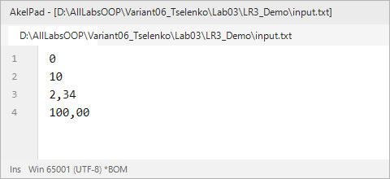
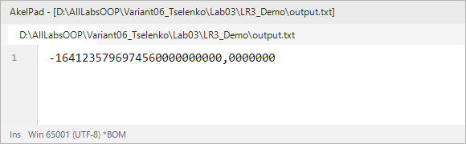
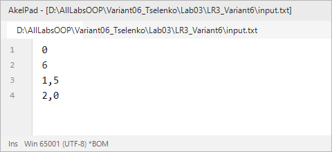
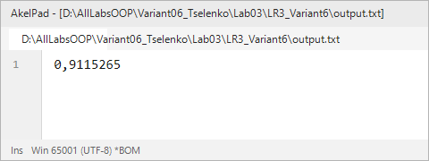

# Северо-Кавказский федеральный университет
**Институт цифрового развития**  
**Кафедра прикладной информатики**

---

### ОТЧЕТ
### по лабораторной работе №3
**по дисциплине: «Объектно-ориентированное программирование»**  
**Тема: «Управление потоком выполнения в программе»**  
**Вариант №6**

**Выполнил:**  
студент группы ПИН-б-о-24-2  
Целенко А. А.  

Ставрополь, 2026 г.

---

## 1. Цель и задачи работы

**Цель работы:** Изучить операторы, позволяющие организовывать непоследовательное выполнение программного кода (ветвления и циклические конструкции).

**Задачи работы:**
1. Научиться применять условный оператор `if .. else` и оператор выбора `switch`.
2. Научиться применять циклические конструкции `for`, `while`, `do … while`.
3. Научиться выявлять математические закономерности изменения членов ряда и организовывать их итерационный расчет.
4. Закрепить навыки работы с файловым вводом-выводом через перенаправление потоков.

---

## 2. Ход выполнения работы

### 2.1. Учебная задача (демонстрационный пример)
В учебной задаче выполняется вычисление суммы $N$ членов ряда:
$$Z = \frac{1 \cdot 3 \cdot X^2}{2!} - \frac{3 \cdot 5 \cdot Y^4}{4!} + \frac{5 \cdot 7 \cdot X^6}{6!} - \frac{7 \cdot 9 \cdot Y^8}{8!} + \dots$$
Параметры считываются из файла `input.txt`: тип используемого цикла $t$ (0 – `for`, 1 – `while`, 2 – `do..while`), число слагаемых $N$, и вещественные значения $X$ и $Y$. Результат записывается в файл `output.txt`.

**Листинг программы (`LR3_Demo/Program.cs`):**
```csharp
using System;
using System.IO;

namespace LR_Three_Demo
{
    class Program
    {
        static void Main(string[] args)
        {
            TextWriter save_out = Console.Out;
            TextReader save_in = Console.In;

            var new_out = new StreamWriter(@"output.txt");
            var new_in = new StreamReader(@"input.txt");

            Console.SetOut(new_out);
            Console.SetIn(new_in);

            int t = 0, N = 1;
            double X = 0, Y = 0, Z = 0;

            t = Convert.ToInt32(Console.ReadLine());
            N = Convert.ToInt32(Console.ReadLine());
            X = Convert.ToDouble(Console.ReadLine().Trim().Replace('.', ','));
            Y = Convert.ToDouble(Console.ReadLine().Trim().Replace('.', ','));

            int i = 1, step = 1;
            double znam = 1, chisl;

            if (t == 0)
            {
                for (i = 1; i <= N; i++)
                {
                    step = i * 2;
                    znam *= (step - 1) * step;
                    if (i % 2 == 0)
                        chisl = -Math.Pow(Y, step);
                    else
                        chisl = Math.Pow(X, step);

                    Z += (step - 1) * (step + 1) * chisl / znam;
                }
            }

            if (t == 1)
            {
                i = 1;
                while (i <= N)
                {
                    step = i * 2;
                    znam *= (step - 1) * step;
                    if (i % 2 == 0)
                        chisl = -Math.Pow(Y, step);
                    else
                        chisl = Math.Pow(X, step);

                    Z += (step - 1) * (step + 1) * chisl / znam;
                    i++;
                }
            }

            if (t == 2)
            {
                i = 1;
                do
                {
                    step = i * 2;
                    znam *= (step - 1) * step;
                    if (i % 2 == 0)
                        chisl = -Math.Pow(Y, step);
                    else
                        chisl = Math.Pow(X, step);

                    Z += (step - 1) * (step + 1) * chisl / znam;
                    i++;
                } while (i <= N);
            }

            Console.WriteLine(string.Format("{0:0.0000000}", Z));

            Console.SetOut(save_out);
            new_out.Close();
            Console.SetIn(save_in);
            new_in.Close();
        }
    }
}
```

**Файлы учебной задачи:**

| Входной файл `input.txt` | Выходной файл `output.txt` |
|---|---|
|  |  |

---

### 2.2. Индивидуальное задание (Вариант 6)

#### Постановка задачи:
Требуется написать программу для вычисления суммы членов ряда:
$$Z = 1 - \frac{X}{2} + \frac{Y^2}{6} - \frac{X^3}{24} + \frac{Y^4}{120} - \dots \quad \text{(в знаменателе факториал)}$$

- Все исходные данные считываются из входного файла `input.txt`:
  - Строка 1: целое число $t$ ($0$ – цикл `for`, $1$ – цикл `while`, $2$ – цикл `do..while`);
  - Строка 2: целое число $N$ — количество вычисляемых слагаемых;
  - Строки 3 и 4: вещественные числа $X$ и $Y$.
- Результат вычисления $Z$ записывается в файл `output.txt`.

#### Анализ закономерности ряда:
Ряд начинается с начального значения $Z = 1$.  
Рассмотрим слагаемое с номером $i$ ($i = 1, 2, \dots, N$):
1. **Знаменатель:** факториал $(i + 1)!$ (при $i=1$: $2! = 2$, при $i=2$: $3! = 6$, при $i=3$: $4! = 24$, при $i=4$: $5! = 120$).
2. **Числитель:**
   - Если $i$ нечетное: $X^i$ со знаком «минус» ($-X^1, -X^3, -X^5$);
   - Если $i$ четное: $Y^i$ со знаком «плюс» ($+Y^2, +Y^4, +Y^6$).
3. Формула $i$-го слагаемого:
   $$\text{term}_i = 
   \begin{cases}
   -\dfrac{X^i}{(i + 1)!}, & i \text{ — нечетное,} \\[2ex]
   +\dfrac{Y^i}{(i + 1)!}, & i \text{ — четное.}
   \end{cases}
   $$

#### Исходный код программы (`LR3_Variant6/Program.cs`):
```csharp
using System;
using System.IO;

namespace LR_Three_Variant6
{
    class Program
    {
        static void Main(string[] args)
        {
            // Сохранение исходных потоков ввода-вывода
            TextWriter save_out = Console.Out;
            TextReader save_in = Console.In;

            var new_out = new StreamWriter(@"output.txt");
            var new_in = new StreamReader(@"input.txt");

            Console.SetOut(new_out);
            Console.SetIn(new_in);

            int t = 0, N = 1;
            double X = 0, Y = 0, Z = 1.0;

            t = Convert.ToInt32(Console.ReadLine().Trim());
            N = Convert.ToInt32(Console.ReadLine().Trim());
            X = Convert.ToDouble(Console.ReadLine().Trim().Replace('.', ','));
            Y = Convert.ToDouble(Console.ReadLine().Trim().Replace('.', ','));

            if (t == 0)
            {
                // Реализация с использованием цикла for
                double fact = 1.0;
                for (int i = 1; i <= N; i++)
                {
                    fact *= (i + 1);
                    double term;
                    if (i % 2 != 0)
                    {
                        double chisl = Math.Pow(X, i);
                        term = -chisl / fact;
                    }
                    else
                    {
                        double chisl = Math.Pow(Y, i);
                        term = chisl / fact;
                    }
                    Z += term;
                }
            }
            else if (t == 1)
            {
                // Реализация с использованием цикла while
                double fact = 1.0;
                int i = 1;
                while (i <= N)
                {
                    fact *= (i + 1);
                    double term;
                    if (i % 2 != 0)
                    {
                        double chisl = Math.Pow(X, i);
                        term = -chisl / fact;
                    }
                    else
                    {
                        double chisl = Math.Pow(Y, i);
                        term = chisl / fact;
                    }
                    Z += term;
                    i++;
                }
            }
            else if (t == 2)
            {
                // Реализация с использованием цикла do ... while
                double fact = 1.0;
                int i = 1;
                if (N >= 1)
                {
                    do
                    {
                        fact *= (i + 1);
                        double term;
                        if (i % 2 != 0)
                        {
                            double chisl = Math.Pow(X, i);
                            term = -chisl / fact;
                        }
                        else
                        {
                            double chisl = Math.Pow(Y, i);
                            term = chisl / fact;
                        }
                        Z += term;
                        i++;
                    } while (i <= N);
                }
            }

            Console.WriteLine(string.Format("{0:0.0000000}", Z));

            // Восстановление потоков и закрытие файлов
            Console.SetOut(save_out);
            new_out.Close();
            Console.SetIn(save_in);
            new_in.Close();
        }
    }
}
```

#### Результаты вычислений и сравнение циклов:
Программа была протестирована на входных параметрах $X = 1{,}5$, $Y = 2{,}0$, $N = 6$:
- При $t = 0$ (`for`): $Z = 0{,}9115265$
- При $t = 1$ (`while`): $Z = 0{,}9115265$
- При $t = 2$ (`do..while`): $Z = 0{,}9115265$

Все три типа циклов дают идентичный результат с точностью до 7 знака после запятой.

| Входной файл `input.txt` | Выходной файл `output.txt` |
|---|---|
|  |  |

---

## 3. Ответы на контрольные вопросы

**1. Опишите, каким образом оформляется комментарий в языке C#.**  
- Однострочный комментарий: две косые черты `// Текст комментария`. Действует до конца текущей строки.  
- Блочный (многострочный) комментарий: заключается между `/*` и `*/` (`/* Текст комментария */`).  
- Документирующий комментарий XML: три косые черты `/// <summary>Описание метода</summary>`.

**2. Какое ключевое (зарезервированное) слово в условном операторе является обязательным?**  
Обязательным является только ключевое слово **`if`**. Конструкции `else if` и `else` являются опциональными.

**3. Дан фрагмент кода:**
```csharp
double x = 2, y = 3, z = 4, res;
Boolean yes = true;
if (!yes)
{
    res = Math.Pow(x, y) * z;
}
else
{
    res = Math.Pow(z, x) * y;
}
```
**Чему равно значение переменной res после выполнения данного фрагмента?**  
Так как `yes = true`, условие `!yes` оценивается как `false`. Выполняется ветка `else`:  
$res = \text{Math.Pow}(4, 2) \cdot 3 = 16 \cdot 3 = 48$.  
Значение переменной `res`: **`48`** (тип `double`).

**4. Дан фрагмент кода:**
```csharp
int counter = 10;
const int N = 10;
for (int i = 0; i < N; i++)
{
    counter += i;
}
```
**Чему равно значение переменной counter после выполнения данного фрагмента?**  
Переменная `i` принимает значения от 0 до 9 включительно.  
Сумма: $0 + 1 + 2 + \dots + 9 = 45$.  
`counter = 10 + 45 = 55`.  
Значение переменной `counter`: **`55`**.

**5. Дан фрагмент кода:**
```csharp
int seo = 0;
const int N = 5;
for (int i = 1; i <= N; i++);
{
    seo += 2;
}
```
**Чему равно значение переменной seo после выполнения данного фрагмента?**  
После заголовка цикла `for` стоит точка с запятой `;`, что образует пустой цикл. Следующий блок кода `{ seo += 2; }` выполняется ровно 1 раз после завершения пустого цикла.  
Значение переменной `seo`: **`2`**.

**6. Что будет выведено в консоль в результате выполнения следующей программы?**
```csharp
static void Main(string[] args)
{
    int a = 0, b = 5, c = 0;
    for (; a < b;)
    {
        a += 5;
        b += 2;
        c++;
    }
    Console.Write(c);
    Console.ReadKey();
}
```
**Трассировка:**
- До цикла: `a = 0`, `b = 5`, `c = 0`.
- Итерация 1: $0 < 5$ (True) $\rightarrow$ `a = 5`, `b = 7`, `c = 1`.
- Итерация 2: $5 < 7$ (True) $\rightarrow$ `a = 10`, `b = 9`, `c = 2`.
- Проверка: $10 < 9$ (False) $\rightarrow$ выход из цикла.  
Будет выведено: **`2`**.

**7. Что будет выведено в консоль в результате выполнения следующей программы?**
```csharp
static void Main(string[] args)
{
    int a = 0, b = 5, c = 0;
    while (a < b)
    {
        a += 5;
        b += 2;
        c++;
    }
    Console.Write(c);
    Console.ReadKey();
}
```
Логика аналогична предыдущему номеру: выполняются те же 2 итерации.  
Будет выведено: **`2`**.

**8. Что будет выведено в консоль в результате выполнения следующей программы?**
```csharp
static void Main(string[] args)
{
    int a = 3, z = 0;
    Boolean _stop = false;
    while (!_stop)
    {
        z += a;
        if (z > 100)
            _stop = true;
    }
    Console.Write(z);
    Console.ReadKey();
}
```
На каждом шаге `z` увеличивается на 3 ($3, 6, \dots, 99, 102$). При $z = 102$ срабатывает условие $102 > 100$, флаг `_stop` становится `true`, цикл завершается.  
Будет выведено: **`102`**.

**9. Что будет выведено в консоль в результате выполнения следующей программы?**
```csharp
static void Main(string[] args)
{
    int a = 3, z = 0;
    do
    {
        z += a;
    } while (z == 0);
    Console.Write(z);
    Console.ReadKey();
}
```
Тело цикла `do` выполняется первый раз: `z = 0 + 3 = 3`.  
Проверяется постусловие: `z == 0` ($3 == 0$ ложно). Цикл завершает работу.  
Будет выведено: **`3`**.

**10. Дан листинг программы:**
```csharp
static void Main(string[] args)
{
    int a = 3;
    int stop = 1;
    while (stop < 10)
    {
        if (a % 2 == 0)
        {
            a++;
        }
        else
        {
            continue;
        }
        stop++;
    }
    Console.Write(a);
    Console.ReadKey();
}
```
**Что будет выведено в консоль?**  
Переменная `a = 3` (нечетная), условие `a % 2 == 0` ложно, выполняется ветка `else { continue; }`. Оператор `continue` немедленно переходит на следующую итерацию, минуя оператор `stop++`. Происходит **бесконечный цикл (зацикливание)**. Программа зависает, в консоль **ничего не будет выведено**.

---

## 4. Вывод
В ходе работы были практически освоены операторы ветвления `if..else` и циклические конструкции `for`, `while`, `do..while`. Была решена задача вычисления суммы знакопеременного ряда со слагаемыми на основе факториалов по варианту №6 всеми тремя способами с подтверждением идентичности полученных результатов.
